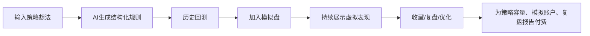

# AI量化投研 + 模拟盘融合版产品总蓝图

## 1. 产品结论

上一版“市场解释、风险卡、知识库”仍然有价值，但不应作为核心商业能力。普通用户如果只是想看市场解释，确实更容易去大平台、财经App或直接问AI；小团队很难靠“解释得更明白”建立长期付费信任。

更有商业张力的方向是：**AI量化策略模拟盘**。

产品不直接告诉用户买什么，而是让用户把策略放进虚拟资金账户中持续运行，用公开、可复盘的模拟表现建立信任。

产品一句话：

> 用虚拟资金验证AI量化策略，让策略先在模拟盘里跑出证据。

核心主线：

## 2. 产品定位

### 推荐产品名

- Alpha模拟场
- AI策略模拟场
- Alpha雷达模拟盘

推荐使用 **Alpha模拟场**，因为它天然强调“实验、观察、验证”，比“AI交易员”更安全，也比“投研助手”更有付费想象力。

### 对外表达

必须持续强调：

- 只做虚拟资金模拟。
- 不接真实资金。
- 不自动下单。
- 不提供跟单按钮。
- 不承诺收益。
- 不构成投资建议。

推荐宣传语：

- 漂亮回测不算数，持续模拟表现才算数。
- 所有策略先上模拟盘，跑出证据再说。
- AI负责生成想法，量化负责验证，模拟盘负责公开检验。

不推荐宣传语：

- AI帮你炒股。
- 自动赚钱机器人。
- 跟着策略买。
- 稳定跑赢市场。
- 高胜率买卖点。

## 3. 目标用户

第一优先级：

- 对AI量化感兴趣，但不会写代码的人。
- 看短视频被“AI交易员/机器人”吸引，想先看模拟效果的人。
- 有ETF/A股交易经验，想验证策略但不敢实盘的人。
- 半小白、半玩家型用户。

第二优先级：

- 有基金/ETF持仓，希望用模拟策略观察轮动、定投、网格、趋势策略的人。
- 想验证缠论、波浪、均线、动量、回撤分批等想法的人。

暂不服务：

- 需要自动下单的人。
- 需要明确买卖点、目标价的人。
- 专业高频交易用户。
- 希望跟单赚钱的人。

## 4. 产品层级

### 核心付费价值层

- AI策略工厂。
- 回测实验室。
- 模拟盘。
- 策略榜单。
- Alpha策略卡。
- 复盘报告。
- 策略容量、回测次数、模拟账户数量。

### 信任与解释辅助层

- 今日市场解释。
- 行业温度。
- 基金/ETF风险卡。
- 小白知识库。

这部分保留，但不作为核心收费点。它的作用是：

- 给策略表现提供市场背景。
- 帮用户理解策略为什么失效或有效。
- 降低合规风险。
- 提供内容增长素材。

## 5. V1核心模块

### 5.1 首页：模拟盘实验场

首屏展示：

- 今日模拟策略榜。
- 正在运行策略数量。
- 最佳稳定性策略。
- 最大回撤警示。
- 产品边界说明。

次级展示：

- 市场温度。
- 行业风险。
- 基金/ETF风险卡入口。
- 知识库入口。

首页必须避免“今天买什么”的暗示。榜单命名使用：

- 模拟表现榜。
- 稳定性榜。
- 风控榜。
- 长跑榜。

不要使用：

- 赚钱榜。
- 牛股榜。
- 跟买榜。

### 5.2 AI策略工厂

用户输入：

- 我想做一个沪深300回撤分批策略。
- 半导体ETF放量上涨后能不能追？
- 红利ETF能不能用趋势策略？
- 缠论一买二买能不能在ETF上模拟？
- 波浪理论三浪判断怎么验证？

系统输出：

- 策略名称。
- 策略逻辑。
- 标的池。
- 入场规则。
- 退出规则。
- 仓位规则。
- 风控规则。
- 数据周期。
- 不适用场景。

AI只生成策略草稿，用户确认后才能回测或加入模拟盘。

### 5.3 回测实验室

展示：

- 回测区间。
- 收益率。
- 年化收益。
- 最大回撤。
- 胜率。
- 波动率。
- 换手率。
- 交易次数。
- 手续费/滑点假设。
- 交易明细。
- 过拟合提示。
- 失效条件。

必须展示：

> 回测只能说明历史样本表现，不代表未来收益。

### 5.4 模拟盘

核心功能：

- 每个策略绑定一个虚拟账户。
- 初始虚拟本金默认 100000 元。
- 按日线盘后或下一交易日规则更新。
- 展示虚拟持仓、虚拟成交、现金、权益曲线、回撤曲线。
- 展示运行天数、风控事件、策略状态。

策略状态：

- 待回测。
- 可模拟。
- 运行中。
- 暂停。
- 失效。
- 数据不足。

V1不做：

- 实时实盘下单。
- 券商连接。
- 充值交易。
- 跟单按钮。

### 5.5 策略榜单

榜单用于激发持续围观和策略竞争，但必须避免荐股化。

入榜条件：

- 至少运行20个交易日。
- 交易次数达到最低要求。
- 未频繁重置策略。
- 最大回撤未超过规则阈值。
- 数据完整度达标。

综合评分维度：

- 收益分。
- 回撤分。
- 稳定性分。
- 换手惩罚。
- 运行天数分。
- 风控事件惩罚。

榜单展示：

- 策略名称。
- 策略类型。
- 虚拟收益。
- 最大回撤。
- 运行天数。
- 风险等级。
- 是否可查看详情。

当前持仓和虚拟成交建议盘后或延迟展示，降低被用户当作实时跟单信号的风险。

### 5.6 Alpha策略卡

策略卡是产品的核心内容单元。

字段：

- 策略名称。
- 策略来源：用户输入、模板策略、本地alpha启发、技术结构策略。
- 策略逻辑。
- 适用市场。
- 标的池。
- 回测摘要。
- 模拟盘摘要。
- 虚拟持仓摘要。
- 风控事件。
- 风险反例。
- 失效条件。
- 非投资建议提示。

### 5.7 投研解释辅助层

保留上一版能力：

- 今日市场解释。
- 行业温度。
- 基金/ETF风险观察卡。
- 小白知识库。

但角色调整为：

- 给策略表现做背景解释。
- 辅助用户理解行业/ETF风险。
- 为内容渠道提供素材。
- 不作为主要付费点。

## 6. 本地alpha和开源项目用法

### 本地alpha资产

本地 `C:\Users\Windows11\Desktop\alpha` 资产用于后台，不直接向用户暴露复杂表达式。

用途：

- 策略灵感库：提取动量、反转、质量、波动、成交、基本面等策略族。
- 过拟合警报：利用 novelty、self-correlation、turnover、fitness 等概念解释策略风险。
- 策略标签：为策略打上 alpha family、数据字段、结构复杂度等标签。
- 失败案例库：展示回测漂亮但模拟盘失效的案例。
- 内容工厂：生成“策略模拟盘第X天”的内容素材。

### 开源项目分工

| 资源 | 用途 | V1优先级 |
|---|---|---|
| AKShare | A股/ETF/基金基础数据 | P0 |
| efinance/qstock | 数据补充和备份 | P0 |
| vectorbt | 快速回测 | P0 |
| 本地alpha | 策略灵感和过拟合检查 | P0 |
| Qbot | 策略分类、商业分层参考 | P1 |
| chan.py/chanlun | 缠论结构观察图层 | P2 |
| Backtrader | 传统策略演示 | P2 |
| Qlib | 机器学习研究 | P3 |
| vn.py | 后期交易架构参考 | P3，不接实盘 |

## 7. 技术路线

### 数据层

V1默认：

- A股/ETF日线数据。
- 盘后更新。
- 免费数据源起步。
- 付费数据源后置。

数据异常处理：

- 缺数据时策略状态为“数据不足”。
- 停牌、休市不生成虚假成交。
- 免费源异常时提示延迟。

### 计算层

- 指标计算：确定性代码。
- 回测：vectorbt 优先。
- 虚拟撮合：自建日线模拟引擎。
- 策略评分：确定性评分公式。
- AI解释：只基于已计算结果生成。

### AI层

AI负责：

- 策略草稿生成。
- 策略逻辑解释。
- 回测报告改写。
- 模拟盘周报。
- 失败原因解释。

AI不负责：

- 直接生成买卖建议。
- 编造行情数据。
- 编造收益表现。
- 替用户做真实交易决策。

## 8. 商业化

免费版：

- 查看公开策略榜单。
- 创建1个策略。
- 每日有限回测次数。
- 查看延迟模拟盘表现。
- 基础市场解释和风险卡。

标准版：69-99元/月。

- 创建更多策略。
- 更多回测次数。
- 策略持续模拟。
- 策略复盘报告。
- 观察列表和提醒。
- Alpha策略模板库。

Pro版：199-399元/月，后置。

- 多策略组合模拟。
- 批量参数扫描。
- 高级技术结构图层。
- 高级风控诊断。
- 更长历史数据。
- 导出报告。

暂不做：

- 策略作者收费带单。
- 用户订阅策略信号。
- 收益分成。
- 实盘接口。

## 9. 验证路径

4周验证目标：

- 用户是否愿意持续观察策略模拟表现。
- 用户是否愿意提交自己的策略想法。
- 用户是否愿意为策略容量、回测次数、模拟账户付费。

成功标准：

- 用户连续查看同一策略。
- 策略收藏率超过10%。
- 用户提交策略想法超过50条。
- 20-50人愿意为内测付费。
- 用户接受“只模拟、不建议、不跟单”的边界。

停止信号：

- 用户只想要实时买卖点。
- 用户不关心模拟过程，只关心收益截图。
- 榜单被理解成荐股榜。
- 付费动机主要是“跟着策略买”。
- 合规边界导致核心体验无法成立。

## 10. 参考来源

- QuantConnect Pricing：https://www.quantconnect.com/pricing?purchase=qcc
- Composer：https://www.composer.trade/
- TrendSpider Pricing：https://trendspider.com/pricing/
- RiceQuant 文档：https://www.ricequant.com/doc/quant/
- RiceQuant 实时模拟交易：https://www.ricequant.com/doc/quant/pt.html
- BigQuant：https://bigquant.com/about/
- Collective2：https://www.collective2.com/choose-plan
- Numerai Docs：https://docs.numer.ai/community/community-built-products/numerai-structure
- 江苏证监局AI炒股风险提示：https://www.csrc.gov.cn/jiangsu/c105410/c7612290/content.shtml
- 证券市场程序化交易管理规定：https://www.csrc.gov.cn/csrc/c100028/c7480577/content.shtml
- 证券投资顾问业务暂行规定：https://www.gov.cn/gongbao/content/2011/content_1808618.htm

