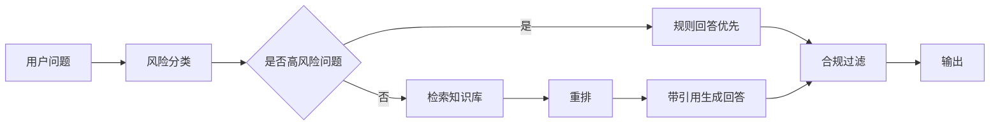

# 知识库与RAG方案

## 1. 目标

知识库不是泛泛百科，而是服务三个目标：

- 帮用户理解策略、回测、模拟盘和风险。
- 给AI解释提供可引用依据。
- 降低合规风险，避免AI自由发挥。

## 2. 内容结构

V1知识库分为六类：

- 产品帮助：如何创建策略、如何看回测、如何看模拟盘、如何看榜单。
- 量化基础：回撤、夏普、胜率、盈亏比、波动率、换手率、过拟合。
- 策略案例：轮动、网格、均线、回撤分批、动量、防守策略。
- 失败案例：回测好但模拟差、换手过高、过拟合、样本太短。
- 合规说明：非投资建议、虚拟模拟、不能跟单、不能承诺收益。
- 数据口径：费用、滑点、T+1、停牌、涨跌停、复权、交易日历。

扩展为九类内容资产：

- 市场知识库：行业分类、ETF类型、财报基础、公告类型、监管事件。
- 案例知识库：成功策略、失败策略、模拟盘周报、用户高频问题复盘。
- 数据字典库：每个指标的来源、计算公式、更新时间、适用范围、限制。

内容优先级：

1. 与策略生成、回测、模拟盘解释直接相关的内容。
2. 与A股/ETF数据口径、财报、公告、行业解释相关的内容。
3. 与合规边界和风险提示相关的内容。
4. 能带来SEO和短视频脚本素材的基础教育内容。

## 2.1 AI问答入口

V1新增“问问Alpha”入口，但定位是“基于站内内容和结构化数据的检索问答”，不是投资顾问。

页面入口：

- 全站右下角：`问问Alpha`，回答产品使用、量化概念、数据口径、知识库问题。
- 策略详情页：`问这个策略`，默认注入当前 `StrategySpec`、`BacktestReport`、`SimulationRun`。
- 回测报告页：`解释这个回测`，重点解释回撤、胜率、换手、手续费、过拟合。
- 风险卡页：`解释这个风险`，默认注入当前风险卡、数据来源、风险标签。
- 行业温度页：`问这个行业`，默认注入行业快照、行业ETF映射、相关新闻摘要。
- 知识库页：`继续追问`，围绕当前文章和引用片段继续问。

允许回答：

- 这个策略的规则是什么。
- 为什么这个策略回撤较大。
- 回测和模拟盘有什么区别。
- 某个指标如何计算、多久更新。
- 某个行业/ETF的风险标签是什么意思。
- 某个公告/财报指标对风险卡有什么背景意义。
- 如何把一个想法转成可回测规则。

禁止回答：

- 现在能买吗。
- 推荐一只股票/ETF。
- 跟哪个策略买。
- 目标价是多少。
- 明天涨跌概率是多少。
- 哪个策略最赚钱。
- 是否应该加仓、清仓、抄底。

## 3. RAG流程



高风险问题：

- 现在能买吗？
- 该不该跟这个策略买？
- 哪个策略最赚钱？
- 这个策略能赚多少？
- 推荐一只股票。

高风险问题先用规则回答，再提供可选的模拟盘/回测解释入口。

## 3.1 开源模型与检索栈

V1默认免费/开源优先，不把低价API作为长期依赖。

生成模型：

- 首选：Qwen3 8B/14B Instruct，中文能力、工具调用、长上下文和本地部署生态较平衡。
- 轻量备选：Qwen3 4B 或更小Qwen模型，用于产品帮助、短回答、低并发验证。
- 复杂推理后置：DeepSeek-R1-Distill-Qwen 7B/14B，用于策略解释、回测异常诊断、复杂问答，但要控制推理长度和成本。
- 商业API兜底：仅在本地模型质量不足或高峰期不可用时临时启用，默认不作为产品卖点。

向量模型：

- 首选：Qwen3-Embedding 0.6B/4B，中文和多语言检索强，支持长文本和指令化检索。
- 备选：BGE-M3，支持dense、sparse、multi-vector混合检索，适合成本敏感和中文文档混合检索。

重排模型：

- 首选：Qwen3-Reranker 0.6B/4B。
- 备选：BGE Reranker。

存储与服务：

- PostgreSQL + pgvector作为V1向量存储。
- BM25/全文索引用PostgreSQL全文检索或OpenSearch后置。
- Ollama/llama.cpp适合低成本验证。
- vLLM/SGLang适合有GPU后的正式服务。
- 所有模型响应必须经过合规过滤和引用检查。

## 3.2 问答编排流程

1. 接收问题，记录页面来源、用户ID、上下文ID。
2. 风险分类：普通问答、产品帮助、策略解释、行情/财报解释、高风险买卖问题。
3. 高风险问题直接规则回复，不进入自由生成。
4. 根据页面上下文注入结构化数据：策略、回测、模拟、风险卡、财报、公告、行业快照。
5. 检索知识库、数据字典、公告摘要、监管说明。
6. rerank后选择引用片段。
7. 生成回答，必须包含“依据/来源/限制”。
8. 合规过滤：拦截买卖建议、收益承诺、目标价、跟单暗示。
9. 若资料不足，回答“暂无足够依据”，并给出可查看的数据或知识入口。
10. 记录问题、命中文档、是否追问、是否点赞/点踩、是否触发高风险。

## 3.3 问答输出模板

普通解释：

```text
简短回答：
依据：
- 来源1：...
- 来源2：...
限制：
这只是基于当前数据和知识库的解释，不构成投资建议。
下一步可查看：
- 回测报告
- 模拟盘表现
- 风险卡
```

高风险拒答：

```text
我不能回答“现在是否买入/卖出”这类问题，也不能推荐跟随某个策略。
可以帮你做三件事：
1. 解释这个标的/策略当前有哪些风险证据。
2. 把你的想法改写成可回测规则。
3. 查看该规则的历史回测和虚拟模拟表现。
```

数据不足：

```text
知识库和当前数据暂无足够依据，不能生成确定解释。
已记录这个问题，后续可补充相关数据源或知识文档。
```

## 4. 知识片段字段

```json
{
  "chunk_id": "kb_001_03",
  "document_id": "kb_001",
  "title": "为什么回测不等于未来收益",
  "category": "risk_education",
  "content": "回测只能说明策略在历史样本中的表现...",
  "source_type": "internal_doc",
  "created_at": "2026-06-06",
  "risk_level": "normal",
  "must_cite": true,
  "source_url": "https://example.com/source",
  "rights_status": "public_linkable",
  "updated_at": "2026-06-06",
  "related_symbols": ["510300"],
  "related_strategy_ids": ["str_001"]
}
```

## 5. 回答规则

必须：

- 引用知识库片段或产品数据。
- 说明不构成投资建议。
- 区分回测、模拟盘和真实投资。
- 高风险问题不输出买卖建议。

禁止：

- 编造监管结论。
- 编造行情。
- 编造策略收益。
- 根据榜单推荐跟买。

## 6. 首批知识库文章

- 回测为什么不等于未来收益。
- 模拟盘和真实交易有什么区别。
- 最大回撤为什么比收益更重要。
- 胜率高为什么也可能亏钱。
- 滑点和手续费如何影响策略。
- A股T+1对策略有什么影响。
- 停牌和涨跌停如何影响模拟盘。
- 什么是过拟合。
- 网格策略适合什么行情。
- 轮动策略为什么会在震荡期失效。
- 缠论图层能看什么，不能看什么。
- 波浪理论为什么不能当确定预测。
- 为什么本产品不提供跟单。
- 如何阅读Alpha策略卡。

新增数据与市场类：

- 如何看ETF规模、成交额和溢价率。
- 申万行业、中信行业和概念板块有什么区别。
- 公司公告有哪些类型，哪些只代表风险背景。
- 财报三张表分别看什么。
- ROE、毛利率、负债率、经营现金流如何影响风险判断。
- 新闻为什么只能作为背景，不能直接变成交易信号。
- 多源数据冲突时为什么不生成结论。
- 免费数据源和商业数据源有什么差异。
- 为什么模拟盘表现不等于真实收益。
- 为什么榜单不是推荐榜。

新增用户问题类：

- 我只想知道能不能买，为什么系统不回答。
- 如何把“缠论一买二买”改写成可回测规则。
- 如何判断一个策略是否过拟合。
- 为什么高收益策略可能排不到稳定性榜前面。
- 如何用观察列表跟踪基金/ETF风险变化。

## 6.1 外部资料入库清单

优先入库：

- 官方文档：产品帮助、数据字典、策略规则说明。
- 监管公开资料：证监会、交易所、协会风险提示和规则。
- 交易所/巨潮公告：标题、摘要、链接、发布时间、关联标的。
- 开源项目文档：vectorbt、Backtrader、Qlib、vn.py、Qbot、AKShare、BaoStock、Tushare公开文档。
- 本地alpha资料：因子类型、策略族、失败案例、过拟合提示、策略质量评分逻辑。

暂不入库或只存元数据：

- 商业研报全文。
- 付费资讯全文。
- 未确认版权的长文。
- 社交平台评论和群聊内容。
- 没有来源链接的二手转述。

## 6.2 用户问题沉淀

每个AI问答会话记录：

- `question_id`、用户ID、页面来源、上下文对象。
- 原始问题、风险分类、命中文档、引用片段。
- 是否触发合规拒答。
- 是否继续追问。
- 用户反馈：有用、没用、举报、转人工。
- 后续标签：新增知识库选题、功能需求、策略模板需求、数据缺口、合规样本。

每周产出：

- 高频问题Top20。
- 未命中文档问题Top20。
- 高风险问题样本。
- 新增知识库文章清单。
- 新增策略模板需求。
- 数据源缺口清单。

## 7. 运营维护

每周：

- 新增至少3篇策略案例或失败案例。
- 更新常见问题。
- 汇总用户高频问题。

每月：

- 审查合规文案。
- 删除过期数据口径。
- 更新产品帮助。

## 8. 测试要求

- 高风险问题必须触发规则回答。
- 普通知识问题必须带引用。
- 无知识依据时回答“知识库暂无依据”，不能编。
- 回答中不得出现买卖建议、目标价、收益承诺。

## 9. 参考来源

- [Qwen3 官方介绍](https://qwenlm.github.io/blog/qwen3/)
- [Qwen3-Embedding GitHub](https://github.com/QwenLM/Qwen3-Embedding)
- [BGE-M3 技术报告](https://arxiv.org/abs/2402.03216)
- [DeepSeek-R1 GitHub](https://github.com/deepseek-ai/DeepSeek-R1)
- [AKShare 文档](https://akshare.akfamily.xyz/)
- [证券投资顾问业务暂行规定](https://www.gov.cn/gongbao/content/2011/content_1808618.htm)
- [江苏证监局AI炒股风险提示](https://www.csrc.gov.cn/jiangsu/c105410/c7612290/content.shtml)
