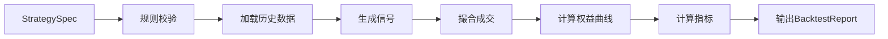

# 量化策略引擎方案

## 1. 目标

策略引擎负责把用户或模板生成的策略规则变成可回测、可模拟、可解释的确定性流程。AI只生成规则草稿，不直接参与收益计算和虚拟成交。

## 2. 设计原则

- 回测和模拟使用同一份 `StrategySpec`。
- 所有计算可复现。
- 费用、滑点、T+1、停牌、涨跌停、最小交易单位必须显式处理。
- 回测结果必须保留交易明细，便于审计。
- 策略不输出真实买卖建议，只输出“规则触发”和“虚拟模拟变化”。

## 3. 策略规则类型

P0支持：

- 均线趋势：MA20、MA60金叉/死叉。
- 动量轮动：多ETF按20/60日收益排序。
- 回撤分批：从近期高点回撤达到阈值后分批建仓。
- 网格：价格区间内按固定间距虚拟买卖。
- 波动过滤：波动率超过阈值时降低仓位。
- 风控止损：策略权益回撤超过阈值后暂停。

P1支持：

- 行业ETF轮动。
- 红利/宽基/黄金/债券风险平衡。
- RSI/MACD/布林带组合。

P2支持：

- 缠论结构观察。
- 波浪可能路径。
- 本地alpha启发策略族。

## 4. 回测流程



指标：

- 总收益。
- 年化收益。
- 最大回撤。
- 胜率。
- 波动率。
- 夏普。
- 换手率。
- 交易次数。
- 平均持仓天数。

## 5. 模拟盘流程


虚拟撮合规则：

- V1默认按下一交易日开盘价或盘后可得收盘价模拟，必须在报告中展示规则。
- A股股票和ETF默认最小交易单位100份。
- T+1：当日虚拟买入的持仓不能当日虚拟卖出。
- 停牌：不成交。
- 涨跌停：按规则标记成交受限，V1可先不成交。
- 手续费：默认0.03%，可配置。
- 滑点：默认5bps，可配置。

## 6. 策略评分

综合评分不只看收益。

建议公式：

```text
total_score =
  return_score * 0.25
  + drawdown_score * 0.30
  + stability_score * 0.20
  + duration_score * 0.15
  - turnover_penalty * 0.10
  - risk_event_penalty
```

说明：

- 收益高但回撤大，不应排名过高。
- 运行天数太短，不能入长跑榜。
- 高频换手策略在V1应被惩罚。
- 风控事件频繁触发，应降权。

## 7. V1策略模板

| 模板 | 标的 | 逻辑 | 风险 |
|---|---|---|---|
| 宽基ETF轮动 | 沪深300/中证500/创业板 | 选择动量较强ETF | 震荡市场容易来回切换 |
| 行业ETF动量 | 半导体/医药/军工/红利 | 按20/60日收益排序 | 高位拥挤和回撤 |
| 红利防守 | 红利ETF | 趋势向上时持有 | 利率和风格切换 |
| 黄金/债券避险 | 黄金ETF/债券ETF | 权益市场高波动时切换 | 避险资产也会回撤 |
| 网格策略 | 宽基ETF | 固定区间买低卖高 | 单边趋势失效 |
| 均线趋势 | ETF | MA20/MA60过滤 | 滞后和假突破 |
| 回撤分批 | ETF | 回撤达到阈值分批 | 越跌越买风险 |
| 缠论观察 | ETF/指数 | 结构观察，不直接交易 | 主观解释风险 |
| 波浪路径 | ETF/指数 | 可能路径验证 | 自动标浪不可靠 |
| alpha启发 | ETF/行业 | 因子族启发 | 过拟合和迁移失败 |

## 8. 测试要求

- 同一策略、同一数据、同一费用参数，回测结果必须一致。
- 费用/滑点改变后收益变化。
- T+1规则必须阻止当日买入当日卖出。
- 停牌和涨跌停不能生成不合理成交。
- 策略暂停后模拟盘不再生成虚拟订单。
- 数据不足时策略状态为 `data_insufficient`。

