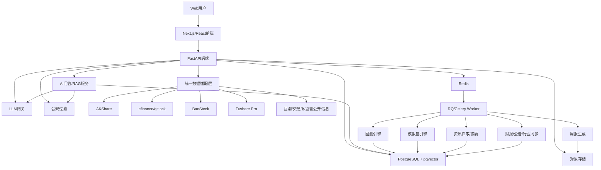

# 技术架构方案

## 1. 架构目标

V1要优先做出稳定、可验证、可维护的模拟盘闭环，而不是追求复杂交易系统。

目标：

- 支持A股/ETF日线数据。
- 支持自然语言策略生成、回测、模拟盘、榜单和复盘。
- 支持盘后批量更新。
- 支持数据质量检测和合规过滤。
- 支持后续扩展到付费、更多数据源、技术图层和多策略组合。

## 2. 总体架构



## 3. 技术选型

前端：

- Next.js/React。
- 图表：ECharts 或 Lightweight Charts。
- 页面：策略创建、回测报告、模拟盘、榜单、风险卡、知识库。

后端：

- Python FastAPI。
- Pydantic定义API对象。
- SQLAlchemy/SQLModel管理数据库。

异步任务：

- Redis + RQ 或 Celery。
- V1推荐RQ，更轻；如果后续任务复杂再迁移Celery。

数据库：

- PostgreSQL。
- pgvector用于知识库向量检索。
- V1不单独上Milvus/Qdrant，降低运维复杂度。

对象存储：

- 保存回测报告快照、策略周报、图表图片、导出文件。

AI：

- 统一LLM网关。
- LLM只负责策略草稿、解释、复盘和摘要。
- 指标、回测、模拟、榜单评分必须由确定性代码完成。
- V1生成模型优先自托管Qwen3 8B/14B Instruct；机器不足时降级到更小Qwen模型。
- 策略解释、复杂回测诊断可后置DeepSeek-R1-Distill-Qwen 7B/14B。
- RAG向量模型优先Qwen3-Embedding 0.6B/4B，备选BGE-M3。
- RAG重排模型优先Qwen3-Reranker 0.6B/4B，备选BGE Reranker。
- 模型服务MVP可用Ollama/llama.cpp；有GPU后改为vLLM/SGLang并提供OpenAI兼容接口。
- 所有AI回答必须经过引用检查和合规过滤；无引用或无结构化依据时输出“暂无足够依据”。

## 4. 后端模块划分

```text
app/
  api/
    strategies.py
    backtests.py
    simulations.py
    leaderboards.py
    market.py
    knowledge.py
    ai_ask.py
    assets.py
    data_sources.py
    compliance.py
  domain/
    strategy.py
    backtest.py
    simulation.py
    scoring.py
    compliance.py
  services/
    strategy_compiler.py
    backtest_engine.py
    paper_trading_engine.py
    market_data_service.py
    news_service.py
    knowledge_service.py
    rag_service.py
    finance_service.py
    announcement_service.py
    industry_service.py
    regulatory_service.py
    report_service.py
  providers/
    akshare_provider.py
    efinance_provider.py
    qstock_provider.py
    baostock_provider.py
    tushare_provider.py
    cninfo_provider.py
    exchange_provider.py
    regulatory_provider.py
  tasks/
    daily_market_sync.py
    sync_announcements.py
    sync_financials.py
    sync_industries.py
    sync_regulatory_items.py
    run_backtest.py
    update_simulations.py
    refresh_rag_index.py
    generate_reports.py
```

## 4.1 AI问答服务架构

AI问答服务不是独立闲聊机器人，而是围绕页面上下文的RAG解释层。

模块：

- `QuestionClassifier`：识别产品帮助、策略解释、回测解释、财报公告解释、高风险买卖问题。
- `ContextAssembler`：按页面注入 `StrategySpec`、`BacktestReport`、`SimulationRun`、`RiskCard`、`FinancialSnapshot`、`AnnouncementItem`。
- `Retriever`：从知识库、数据字典、公告摘要、监管说明检索候选片段。
- `Reranker`：对候选片段重排。
- `AnswerGenerator`：生成带引用回答。
- `ComplianceGuard`：拦截买卖建议、收益承诺、目标价、跟单暗示。
- `QuestionLogger`：记录问题、命中文档、反馈和需求标签。

服务边界：

- 普通问答可以流式返回。
- 高风险问答不进入自由生成，直接规则回复。
- 结构化数据优先级高于知识库文本。
- 无数据、无引用、来源冲突时不生成确定结论。

## 4.2 数据适配服务扩展

新增Provider职责：

- `AnnouncementProvider`：公告列表、公告详情元数据、公告摘要、公告类型和标的关联。
- `FinancialReportProvider`：三大表、关键财务指标、业绩预告、分红、报告期校验。
- `IndustryProvider`：行业分类、概念板块、成分股、行业ETF映射、行业温度。
- `ResearchProvider`：公开研报摘要和资讯摘要，V1不展示受版权保护全文。
- `RegulatoryProvider`：监管规则、风险提示、处罚案例、合规词库更新。

统一约束：

- 所有Provider返回 `source_name`、`source_url`、`fetched_at`、`data_time`、`quality_status`、`rights_status`。
- Provider只负责数据获取和标准化，不负责投资判断。
- 多源冲突由数据质量层记录并降级，不交给AI自行裁决。

## 5. 任务调度

盘前：

- 更新交易日历。
- 检查数据源状态。

盘中：

- V1不做秒级实时。
- 可做低频资讯抓取和市场状态缓存。

盘后：

- 拉取A股/ETF日线。
- 更新基金/ETF风险卡数据。
- 更新所有运行中模拟盘。
- 刷新策略榜单。
- 生成策略周报。

## 6. 数据库核心表

- users：用户。
- strategies：策略规则。
- backtests：回测任务和报告。
- paper_accounts：虚拟账户。
- simulation_runs：模拟运行。
- paper_positions：虚拟持仓。
- paper_trades：虚拟成交。
- strategy_scores：策略评分。
- market_bars：行情K线。
- market_snapshots：市场摘要。
- risk_cards：基金/ETF风险卡。
- news_items：资讯。
- asset_profiles：标的画像、行业、概念、ETF映射。
- financial_snapshots：财报和关键财务指标。
- announcement_items：公告、摘要、风险标签。
- industry_snapshots：行业温度、行业成分、ETF映射。
- regulatory_items：监管规则、风险提示、处罚案例。
- source_registry：数据源、授权口径、限流和可展示范围。
- data_conflict_logs：多源冲突记录。
- risk_event_logs：公告、新闻、行情异常形成的风险事件。
- knowledge_documents：知识库文档。
- knowledge_chunks：知识库片段和向量。
- ai_questions：用户问题、页面来源、风险分类、处理状态。
- ai_answer_logs：回答、引用片段、模型、合规结果、用户反馈。
- compliance_audit_logs：合规拦截记录。

## 7. 部署建议

MVP：

- 单台云服务器。
- PostgreSQL + Redis同机或托管。
- FastAPI + Worker分进程运行。
- 前端部署在Vercel或同机Nginx。

验证后：

- 数据库托管。
- Worker独立服务器。
- 对象存储。
- 增加监控、日志和任务告警。

## 8. 关键风险

- 免费数据源稳定性不足：必须设计多数据源fallback和数据质量状态。
- 回测过度乐观：必须显式建模费用、滑点、T+1和停牌。
- AI输出越界：必须先规则过滤，再生成用户可见内容。
- 模拟盘被误解为荐股：当前持仓、交易、榜单必须使用虚拟/延迟/非建议文案。
