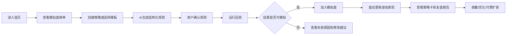

# Alpha模拟场 V1 PRD

## 1. 概述

### 1.1 背景

用户对“AI量化交易机器人”感兴趣，但直接做实盘交易、荐股、买卖建议有明显合规和信任风险。更合理的切入点是：让AI生成的策略先在虚拟资金模拟盘里持续运行，通过可观察、可复盘的模拟表现建立信任。

上一版的市场解释、基金/ETF风险卡、行业温度和知识库继续保留，但不再作为核心付费点。V1核心变为策略生成、回测、模拟盘和榜单。

### 1.2 产品目标

业务目标：

- 4周内验证用户是否愿意持续观察策略模拟表现。
- 4周内验证用户是否愿意提交策略想法。
- 4周内验证用户是否愿意为策略容量、回测次数和模拟账户付费。

用户目标：

- 5分钟内完成“输入策略想法 -> 生成规则 -> 回测 -> 加入模拟盘”。
- 清楚区分回测、模拟盘和真实投资。
- 能看到策略逻辑、风险反例和失效条件。

### 1.3 目标用户

核心用户：

- 对AI量化感兴趣但不会写代码的人。
- 有A股/ETF交易经验，想先用模拟盘验证策略的人。
- 半小白、半玩家型投资者。

辅助用户：

- 想查基金/ETF风险的人。
- 想理解行业温度和市场背景的人。
- 想学习定投、网格、均线、缠论、波浪等策略思想的人。

细分画像与产品重心：

| 用户画像 | 真实诉求 | V1重点功能 | 输出口径 |
|---|---|---|---|
| 小额稳健股民 | 看懂风险、少犯错、跟踪ETF/基金 | 风险卡、观察列表、模拟策略周报、问问Alpha | 观察、谨慎、高风险、数据不足 |
| 策略/投机型用户 | 验证想法、看触发规则、看模拟表现 | AI策略工厂、回测、模拟盘、榜单、参数对比 | 规则触发、虚拟表现、回撤、失效条件 |
| 投资初学者 | 解释术语、理解回测、建立纪律 | 知识库、AI问答、引导模板、失败案例 | 教学化解释、误区提示、引用来源 |
| 量化爱好者 | 更强策略表达、批量验证、导出数据 | StrategySpec编辑器、批量回测、多策略组合、数据导出 | 可复现规则、数据口径、实验记录 |
| 内容创作者 | 需要可展示的策略卡和复盘素材 | 策略卡分享、模拟盘周报、失败案例榜、图表 | 虚拟模拟展示，禁止带单和收费跟随 |

非目标用户：

- 需要明确买卖建议的人。
- 需要跟单的人。
- 需要自动下单的人。
- 专业高频交易者。

## 2. 主流程

## 3. 页面需求

### 3.1 首页

页面目标：

- 让用户第一眼知道这是“虚拟资金策略模拟场”，不是荐股软件。
- 展示正在运行的策略和模拟表现，形成围观感。

主要组件：

- 产品边界提示：虚拟资金模拟，不构成投资建议。
- 今日模拟策略榜。
- 正在运行策略数量。
- 最佳稳定性策略。
- 最大回撤警示。
- 创建策略入口。
- 查看榜单入口。
- 查风险卡入口。
- 市场温度辅助区块。

验收标准：

- 首屏必须出现“虚拟资金模拟”“不构成投资建议”“不接真实资金”。
- 首屏不得出现“买入、卖出、跟买、稳赚、目标价”。
- 用户能在首屏找到“创建策略”和“查看榜单”。

### 3.2 AI策略工厂

用户故事：

> 作为对AI量化感兴趣的用户，我希望输入一句策略想法，系统帮我拆成规则并回测，而不是直接告诉我买什么。

输入：

- 自然语言策略想法。
- 可选标的池。
- 可选风险偏好。
- 可选周期：日线为默认。

输出：

- 策略名称。
- 策略类型。
- 标的池。
- 入场规则。
- 退出规则。
- 仓位规则。
- 风控规则。
- 数据周期。
- 不适用场景。
- 合规提示。

策略来源：

- 用户输入。
- 模板策略。
- 本地alpha启发。
- 技术结构策略。

验收标准：

- AI输出必须是规则草稿，不是买卖建议。
- 用户确认规则后才能回测。
- 禁止出现“建议买入/卖出”。

### 3.3 回测实验室

用户故事：

> 作为策略创建者，我希望先看历史回测表现、回撤和交易次数，再决定是否放入模拟盘。

展示字段：

- 回测区间。
- 收益率。
- 年化收益。
- 最大回撤。
- 胜率。
- 波动率。
- 换手率。
- 交易次数。
- 手续费假设。
- 滑点假设。
- 交易明细。
- 过拟合提示。
- 失效条件。

验收标准：

- 回测必须展示样本区间和费用假设。
- 回测结果不得使用“未来可获得”语气。
- 数据不足时不生成虚假报告。

### 3.4 模拟盘

用户故事：

> 作为用户，我希望把策略加入虚拟账户持续运行，观察它在真实市场数据更新下的表现。

默认规则：

- 默认虚拟本金：100000元。
- 默认市场：A股/ETF。
- 默认频率：日线盘后更新。
- 默认状态：运行中、暂停、失效、数据不足。

展示字段：

- 虚拟账户权益曲线。
- 虚拟现金。
- 虚拟持仓。
- 虚拟成交。
- 当前虚拟收益。
- 最大回撤。
- 运行天数。
- 风控事件。
- 最近更新时间。

验收标准：

- 不接真实资金。
- 不接券商。
- 不提供跟单按钮。
- 当前持仓和成交必须标注“虚拟模拟，非投资建议”。

### 3.5 策略详情页 / Alpha策略卡

用户故事：

> 作为围观者，我希望看懂一个策略为什么这样运行、历史表现如何、模拟表现如何、可能在哪里失效。

页面模块：

- 策略摘要。
- 策略逻辑。
- 标的池。
- 回测报告。
- 模拟盘表现。
- 虚拟持仓摘要。
- 风控事件。
- 风险反例。
- 失效条件。
- 非投资建议提示。

验收标准：

- 策略卡必须同时展示回测和模拟盘表现。
- 必须展示风险反例。
- 不展示实时跟买引导。

### 3.6 策略榜单

用户故事：

> 作为用户，我希望看到哪些策略在模拟盘里表现更稳定，而不是只看收益最高的策略。

榜单类型：

- 模拟表现榜。
- 稳定性榜。
- 风控榜。
- 长跑榜。

入榜条件：

- 至少运行20个交易日。
- 数据完整度达标。
- 未频繁重置。
- 最大回撤未超过规则阈值。

展示字段：

- 策略名称。
- 策略类型。
- 虚拟收益。
- 最大回撤。
- 运行天数。
- 风险等级。
- 综合评分。

验收标准：

- 不使用“赚钱榜”“推荐榜”“跟买榜”。
- 榜单说明必须强调“虚拟模拟表现”。

### 3.7 投研解释辅助层

保留功能：

- 今日市场解释。
- 行业温度。
- 基金/ETF风险观察卡。
- 小白知识库。

定位：

- 解释市场背景。
- 辅助理解策略表现。
- 提供内容增长素材。
- 不作为主要付费功能。

### 3.8 AI问答入口：问问Alpha

用户故事：

> 作为用户，我希望在看策略、回测、风险卡、行业温度或知识库时，可以直接追问“为什么”，但系统不能把回答变成买卖建议。

入口：

- 全站右下角：问问Alpha。
- 策略详情页：问这个策略。
- 回测报告页：解释这个回测。
- 风险卡页：解释这个风险。
- 行业温度页：问这个行业。
- 知识库页：继续追问。

能力范围：

- 检索产品知识库、策略规则、回测报告、模拟盘记录、风险卡、财报公告摘要、监管说明。
- 解释策略逻辑、回测指标、模拟表现、数据口径、行业/ETF风险标签。
- 把用户想法引导成可回测规则。
- 记录用户问题，用于新增知识库、策略模板和数据源。

禁止范围：

- 不回答“现在能买吗”。
- 不推荐股票、基金、ETF。
- 不告诉用户跟哪个策略买。
- 不输出目标价、确定涨跌、收益承诺。
- 不把榜单解释为实盘推荐。

页面状态：

- 普通回答：带来源、限制和下一步入口。
- 高风险问题：规则拒答，并引导查看风险卡/创建模拟策略/学习相关知识。
- 无依据：回答“暂无足够依据”，记录为知识库或数据缺口。
- 来源冲突：提示“数据源冲突”，不输出确定解释。

验收标准：

- 策略详情、风险卡、知识库页面都能唤起问答。
- 问答回答必须带引用或结构化数据来源。
- 高风险买卖问题必须拦截。
- 用户问题必须记录页面来源、风险分类、命中文档和反馈。

### 3.9 数据源透明与数据资产入口

用户故事：

> 作为用户，我希望知道系统的行情、财报、公告、新闻来自哪里，最后更新时间是什么，避免把AI解释误认为确定事实。

页面入口：

- 风险卡：展示行情/基金/ETF数据来源和更新时间。
- 策略详情：展示回测数据源、复权方式、费用和滑点假设。
- 财报解释：展示报告期、来源、发布时间。
- 公告摘要：展示原文链接、摘要标记、风险标签。
- 数据源状态页：展示主要数据源是否正常、延迟、不可用或存在冲突。

验收标准：

- 每个用户可见的数据结论都有来源和更新时间。
- 数据不足时不生成结论。
- 多源冲突时不让AI自行裁决。
- 未确认版权的长文不展示全文。

## 4. 核心数据对象

### StrategySpec

| 字段 | 说明 |
|---|---|
| strategy_id | 策略ID |
| name | 策略名称 |
| source | 用户输入/模板/本地alpha启发/技术结构 |
| universe | 标的池 |
| period | 数据周期 |
| entry_rule | 入场规则 |
| exit_rule | 退出规则 |
| position_rule | 仓位规则 |
| risk_rule | 风控规则 |
| status | 待回测/可模拟/运行中/暂停/失效 |

### BacktestReport

| 字段 | 说明 |
|---|---|
| period | 回测区间 |
| total_return | 总收益 |
| annual_return | 年化收益 |
| max_drawdown | 最大回撤 |
| win_rate | 胜率 |
| volatility | 波动率 |
| turnover | 换手率 |
| trade_count | 交易次数 |
| fee_assumption | 手续费假设 |
| slippage_assumption | 滑点假设 |
| overfit_warning | 过拟合提示 |

### PaperAccount

| 字段 | 说明 |
|---|---|
| account_id | 虚拟账户ID |
| strategy_id | 策略ID |
| initial_cash | 初始虚拟本金 |
| cash | 当前虚拟现金 |
| positions | 虚拟持仓 |
| trades | 虚拟成交 |
| equity_curve | 权益曲线 |
| drawdown_curve | 回撤曲线 |

### SimulationRun

| 字段 | 说明 |
|---|---|
| run_id | 模拟运行ID |
| strategy_id | 策略ID |
| account_id | 虚拟账户ID |
| status | 运行中/暂停/失效/数据不足 |
| running_days | 运行天数 |
| last_updated_at | 最近更新时间 |
| risk_events | 风控事件 |
| leaderboard_eligible | 是否具备榜单资格 |

### StrategyScore

| 字段 | 说明 |
|---|---|
| return_score | 收益分 |
| drawdown_score | 回撤分 |
| stability_score | 稳定性分 |
| turnover_penalty | 换手惩罚 |
| duration_score | 运行天数分 |
| total_score | 综合分 |

## 5. 非功能需求

### 合规

- 所有模拟盘页面显示非投资建议。
- 不接真实资金，不接券商，不自动下单。
- AI输出必须经过合规过滤。
- 付费权益不得包装成赚钱能力。

### 数据

- V1优先A股/ETF日线。
- 数据缺失时策略状态为“数据不足”。
- 停牌、休市不生成虚拟成交。
- 数据覆盖扩展到行情、行业、ETF/基金、个股背景、财报、公告、新闻、监管信息。
- 个股信息只做背景解释和风险标签，不作为荐股入口。
- 所有财报、公告、新闻摘要必须保留来源链接、发布时间和机器摘要标识。
- 多源冲突必须进入数据质量状态，不允许AI生成确定性解释。

### 性能

- 策略规则生成：10秒内返回。
- 回测：普通ETF策略30秒内返回，复杂策略异步处理。
- 模拟盘：盘后批量更新。
- AI问答：普通知识库问答10秒内返回；策略/财报/公告复杂问答可异步或流式返回。

### 埋点

- view_home。
- submit_strategy_idea。
- confirm_strategy_rule。
- run_backtest。
- add_to_paper_trading。
- view_strategy_detail。
- view_leaderboard。
- save_strategy。
- subscribe_plan。
- open_ai_ask。
- submit_ai_question。
- ai_answer_blocked。
- ai_answer_cited。
- ai_answer_no_evidence。
- ai_question_feedback。
- view_data_source_status。
- view_financials。
- view_announcements。

## 6. V1验收清单

- 首页明确模拟盘定位。
- 用户可创建策略并生成规则。
- 用户可运行回测。
- 用户可加入模拟盘。
- 策略详情展示回测、模拟表现、风险反例。
- 榜单只展示虚拟模拟表现。
- 投研解释辅助层仍可访问。
- 全站无明确买卖建议和收益承诺。
- AI问答入口可在首页、策略详情、风险卡和知识库中访问。
- AI问答对买卖建议问题必须拒答，并引导到风险解释或模拟策略。
- 数据源状态、财报、公告、新闻摘要有来源、时间和质量状态。
- 用户问题能进入后台沉淀，形成知识库、策略模板和数据源迭代清单。
